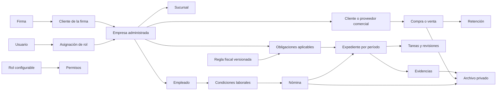

# Plan de backend y PostgreSQL

Estado: **aprobado para implementación**  
Última actualización: 1 de agosto de 2026  
Proyecto: `proyectoxyz`

Este documento reúne los dos planes aprobados para construir el backend del
proyecto. La Fase 0 está implementada y la Fase 1 se encuentra en ejecución
incremental; el estado de cada integración debe comprobarse antes de declararla
productiva.

## Decisiones confirmadas

- PostgreSQL será la base de datos principal.
- El producto operará inicialmente para una sola firma contable.
- Se conservará una entidad `firm` para separar correctamente la configuración
  de la firma de la información de cada empresa.
- El backend será un monolito modular dentro del proyecto Next.js existente.
- Los procesos programados se ejecutarán en un worker separado.
- Prisma será el ORM y la herramienta de migraciones.
- Better Auth se ejecutará localmente y guardará identidad, credenciales
  derivadas y sesiones en PostgreSQL.
- Los roles serán configurables sobre un catálogo fijo de permisos.
- El MFA será obligatorio para administradores, supervisores y colaboradores.
- SeaweedFS será el almacenamiento S3 autohospedado para documentos privados.
- La entrega de correo se realizará por SMTP con Mailrelay.
- La aplicación, PostgreSQL y SeaweedFS vivirán inicialmente en el mismo VPS de
  Contabo.
- El objetivo comprende todas las pantallas existentes, activadas en fases
  verificables.

---

## Plan 1 — Arquitectura y estructura de datos

### 1. Arquitectura general

Se construirá un monolito modular sobre el Next.js existente, manteniendo en un
solo repositorio la interfaz, los servicios de aplicación y el acceso a datos.
No se crearán microservicios ni una API independiente durante esta etapa.

#### Tecnologías

- Node.js 24, Next.js 16, React 19 y TypeScript.
- PostgreSQL 18.
- Prisma ORM estable y Prisma Migrate.
- Better Auth autohospedado.
- Zod y React Hook Form.
- `pg-boss` para trabajos asíncronos y programados sin añadir Redis.
- SeaweedFS mediante una interfaz compatible con S3.
- Nodemailer y Mailrelay SMTP.
- Docker Compose y Caddy.
- ClamAV para revisar archivos cargados.
- Pino para logs estructurados.
- Vitest y Playwright.

#### Contenedores de producción

1. `caddy`: terminación TLS y proxy inverso.
2. `web`: aplicación Next.js.
3. `worker`: vencimientos, notificaciones, exportaciones y procesamiento de
   archivos.
4. `postgres`: base de datos principal.
5. `seaweedfs`: almacenamiento privado de objetos.
6. `clamav`: análisis de archivos en cuarentena.

Solamente Caddy expondrá los puertos 80 y 443. PostgreSQL, el worker, ClamAV y
las consolas administrativas permanecerán en la red privada de Docker.

#### Comunicación interna

- Los Server Components consultarán los servicios de aplicación directamente.
- Las mutaciones de la interfaz usarán Server Actions validadas y autorizadas.
- Los Route Handlers se reservarán para autenticación, archivos, webhooks,
  exportaciones y health checks.
- No se realizará `fetch` interno desde Server Components hacia la propia
  aplicación.
- No existirá una API REST pública hasta que aparezca un consumidor distinto
  del frontend actual.

### 2. Esquemas PostgreSQL

La base se organizará en los siguientes esquemas:

- `auth`: tablas administradas por Better Auth.
- `app`: información funcional del producto.
- `audit`: historial inmutable de acciones relevantes.
- `jobs`: tablas administradas por `pg-boss`.

Prisma gestionará `auth`, `app` y `audit`. El esquema `jobs` se tratará como
infraestructura externa administrada por `pg-boss`.

### 3. Modelo de dominios



#### Identidad y autorización

- Tablas de Better Auth para usuarios, cuentas, sesiones, verificaciones y
  segundo factor.
- `user_profiles`.
- `invitations`.
- `permissions`.
- `roles`.
- `role_permissions`.
- `role_assignments`.

Los permisos serán claves definidas por el código. La firma podrá crear y
modificar roles combinando esas claves, pero no podrá crear permisos arbitrarios
que el servidor no reconozca.

Una asignación de rol podrá tener alcance de firma, empresa o sucursal. El
acceso del cliente se limitará siempre a las empresas expresamente asignadas.

#### Firma, clientes y empresas

- `firms`.
- `firm_clients`.
- `companies`.
- `firm_client_companies`.
- `branches`.
- Contactos y direcciones.
- Representantes legales y responsabilidades con vigencia.
- Planes, servicios incluidos y asignaciones por empresa.

El cliente contractual de la firma, la empresa administrada y el cliente o
proveedor comercial serán entidades distintas.

#### Configuración contable

- `chart_accounts`.
- Plantillas de planes de cuentas.
- Cuentas activas por empresa.
- Asignaciones contables de impuestos, servicios y conceptos laborales.

Esta fase no incluye contabilidad completa ni generación automática de asientos.

#### Reglas tributarias

- Organismos y autoridades.
- Documentos y enlaces fuente.
- Definiciones de obligaciones.
- Versiones de reglas tributarias.
- Configuraciones de vencimiento.
- Versiones de alícuotas IVA.
- Tasas de cambio históricas y su fuente.
- Versiones de calendarios SPE y fechas por terminal de RIF.
- Regímenes tributarios por empresa con vigencia.
- Obligaciones aplicables por empresa.

Una regla utilizada en operaciones o expedientes no podrá editarse. Los cambios
crearán una versión nueva con su fuente, vigencia y responsable.

#### Operaciones comerciales

- Contrapartes comerciales y sus roles de cliente o proveedor.
- Contactos y direcciones de las contrapartes.
- Documentos comerciales de compra y venta.
- Líneas, bases imponibles, impuestos, exentos y exonerados.
- Retenciones, líneas de retención y comprobantes.
- Pagos y referencias.
- Lotes de importación y filas aceptadas o rechazadas.

La importación tendrá dos pasos: validar sin persistir operaciones y confirmar
el lote de forma transaccional e idempotente.

#### Calendario, tareas y declaraciones

- Expedientes por empresa, obligación y período.
- Historial de estados.
- Tareas, responsables y revisores.
- Incidencias y comentarios.
- Ejecuciones de cálculo versionadas.
- Requisitos de evidencia y evidencias aportadas.
- Fechas de presentación, pago y cierre.

Los estados se controlarán en el servidor. No se permitirá cerrar un expediente
si faltan aprobaciones o evidencias requeridas.

#### Servicios y compromisos

- Catálogo de servicios.
- Cuentas de servicio por empresa o sucursal.
- Reglas de vencimiento.
- Compromisos manuales y automáticos.
- Pagos, facturas, solvencias y soportes.

#### Cumplimiento empresarial

- Versiones de cuestionarios.
- Secciones y preguntas.
- Evaluaciones y respuestas.
- Hallazgos, severidad y acciones correctivas.
- Evidencias y reportes generados.

#### Personal y nómina

- Empleados e identidades.
- Versiones de contratos y condiciones laborales.
- Salarios, bonos y configuraciones laborales con vigencia.
- Ausencias, vacaciones y reposos.
- Períodos y ejecuciones de nómina.
- Conceptos por trabajador y corte.
- Recibos, liquidaciones y utilidades.

DPP, IVSS, FAOV e INCES consumirán snapshots de nómina y versiones de reglas
validadas. No se codificarán tasas demostrativas como reglas oficiales.

#### Documentos

- `stored_objects`: objeto físico, tamaño, MIME, checksum y estado.
- `document_versions`: versiones lógicas del documento.
- `document_links`: relación entre documentos y entidades funcionales.
- Estados: pendiente, cuarentena, disponible, rechazado y archivado.

Cada versión tendrá una clave física diferente. La aplicación no sobrescribirá
objetos y su credencial S3 no tendrá permiso para borrarlos físicamente.

#### Plataforma

- Eventos de auditoría append-only.
- Notificaciones y preferencias.
- Outbox de eventos.
- Claves de idempotencia.
- Entregas de correo y webhooks procesados.

### 4. Convenciones y optimización

- UUIDv7 generados por PostgreSQL 18 como claves primarias.
- `timestamptz` para eventos y `date` para períodos fiscales.
- `numeric(20,6)` para importes y mayor precisión para tasas.
- Importes serializados como cadenas decimales, nunca como `number` de
  JavaScript.
- `company_id` obligatorio en toda información operativa.
- `branch_id` opcional sólo donde tenga significado funcional.
- RIF normalizado y restricciones únicas contextualizadas.
- Claves foráneas reales; no se usará `relationMode = "prisma"`.
- Sin borrado en cascada para información fiscal, financiera o laboral.
- `archived_at` para catálogos y estados de anulación para operaciones.
- Columna de versión para control de concurrencia optimista.
- Índices sobre claves foráneas y combinaciones de empresa, estado, período y
  vencimiento.
- Índices parciales para registros pendientes o activos.
- `pg_trgm` para búsquedas por razón social y RIF.
- JSONB limitado a configuraciones variables, snapshots y metadatos externos.
- Sin particionado inicial. Se reevaluará al superar cinco millones de
  operaciones o diez millones de eventos de auditoría.

La separación por empresa se aplicará en dos capas:

1. Autorización explícita en cada servicio de aplicación.
2. Row-Level Security usando el usuario y la empresa establecidos dentro de una
   transacción PostgreSQL.

La conexión de la aplicación no será propietaria de las tablas ni tendrá
`BYPASSRLS`.

### 5. Contratos internos

```ts
type AuthContext = {
  userId: string
  firmId: string
  activeCompanyId: string | null
  allowedCompanyIds: string[]
  permissionKeys: string[]
}

type CommandContext = {
  auth: AuthContext
  requestId: string
  idempotencyKey?: string
}

type Result<T> =
  | { ok: true; data: T }
  | {
      ok: false
      code: "VALIDATION" | "UNAUTHORIZED" | "FORBIDDEN" | "NOT_FOUND" |
        "CONFLICT" | "INFRASTRUCTURE"
      message: string
      fieldErrors?: Record<string, string[]>
    }
```

La interfaz `ObjectStorage` deberá incluir iniciar carga, confirmar carga,
obtener descarga temporal, consultar metadatos, poner en cuarentena y ejecutar
retiros administrativos.

Los endpoints internos iniciales serán:

- `/api/auth/*`.
- `/api/files/upload-intents`.
- `/api/files/:id/complete`.
- `/api/files/:id/download`.
- `/api/exports/:id`.
- `/api/webhooks/mailrelay`, únicamente para eventos que Mailrelay documente y
  permita autenticar; los rebotes administrados por el proveedor se conciliarán
  mediante su API o reportes cuando no exista un evento compatible.
- `/api/health/live`.
- `/api/health/ready`.

### 6. Seguridad

- Registro exclusivamente por invitación.
- Verificación obligatoria del correo.
- Contraseña mínima de 12 caracteres y máximo compatible con Better Auth.
- Hash y sesiones administrados por Better Auth sin criptografía personalizada.
- TOTP y códigos de recuperación obligatorios para el personal.
- Sesiones revocables y cierre de las demás sesiones al cambiar la contraseña.
- Rate limiting por IP y cuenta en login y recuperación.
- Cookies `HttpOnly`, `Secure` y `SameSite=Lax`.
- HSTS, CSP y validación de origen.
- AES-256-GCM con versión de clave para credenciales fiscales y datos bancarios.
- Claves maestras en secretos de Docker, nunca en PostgreSQL ni Git.
- Auditoría de accesos a credenciales, datos bancarios y archivos.
- Logs sin contraseñas, tokens, archivos ni datos sensibles completos.

### 7. Archivos y trazabilidad

1. El servidor crea una intención de carga autorizada.
2. El archivo se guarda con una clave aleatoria en cuarentena.
3. Se valida tamaño, MIME real y checksum SHA-256.
4. ClamAV analiza el archivo.
5. El worker lo promueve a disponible o lo marca como rechazado.
6. La descarga requiere autorización y una URL firmada de corta duración.
7. Una sustitución crea una versión nueva y conserva la anterior.

SeaweedFS se fijará por versión y digest. No se usará la etiqueta `latest` en
producción.

### 8. Respaldo y recuperación

- Confirmar que el complemento Contabo Auto Backup está contratado y activo.
- Crear cada noche un `pg_dump` lógico consistente.
- Generar un manifiesto de objetos y checksums de SeaweedFS.
- Guardar ambos en una ruta incluida en el Auto Backup.
- Verificar diariamente que la copia lógica pueda listarse.
- Restaurar mensualmente PostgreSQL y archivos en un entorno aislado.
- RPO inicial: 24 horas.
- RTO inicial: 8 horas.
- Bloquear producción si Contabo sólo ofrece snapshots manuales.
- Añadir posteriormente una copia independiente del proveedor Contabo.

---

## Plan 2 — Implementación por fases

### Configuración definitiva de Mailrelay SMTP

El correo saliente se enviará mediante Nodemailer y Mailrelay SMTP. Mailrelay
entrega el host, puerto, usuario y contraseña específicos al activar
`Configuración > Configuraciones SMTP`; no se codificará un host supuesto.

La firma administrará estos valores desde `Configuración > Correo`. La
contraseña se cifra con AES-256-GCM y una clave maestra versionada que permanece
fuera de PostgreSQL. La interfaz nunca devuelve la contraseña guardada. Las
variables SMTP siguientes se conservan para correos técnicos previos a disponer
del contexto de firma y para recuperación operativa; no sustituyen el panel.

```dotenv
SMTP_HOST=<host-mostrado-por-mailrelay>
SMTP_PORT=587
SMTP_SECURE=false
SMTP_REQUIRE_TLS=true
SMTP_USER=<usuario-mostrado-por-mailrelay>
SMTP_PASSWORD=<contrasena-smtp-mailrelay>
MAIL_FROM_ADDRESS=acceso@dominio-configurado.com
MAIL_FROM_NAME=proyectoxyz
MAIL_REPLY_TO=soporte@dominio-configurado.com
```

Requisitos:

- STARTTLS obligatorio en el puerto 587.
- El host, puerto y usuario serán exactamente los mostrados por Mailrelay al
  activar SMTP; la contraseña SMTP se tratará como secreto rotatable.
- Todos los remitentes deberán tener SPF configurado antes de que Mailrelay
  permita activar SMTP.
- El dominio y el remitente deben estar autenticados en Mailrelay.
- SPF, DKIM y DMARC deben estar configurados antes de producción.
- La cuenta Mailrelay tendrá MFA habilitado si el plan/cuenta lo ofrece.
- La contraseña SMTP se guardará como secreto de producción y podrá rotarse.
- Cualquier cambio de conexión, dominio o remitente desactivará los envíos y
  exigirá una nueva prueba SMTP antes de reactivarlos.
- Los correos se crearán como trabajos `pg-boss` y se enviarán fuera de la
  petición web.
- Los errores SMTP temporales usarán reintentos con backoff; los permanentes se
  registrarán sin reintentos infinitos.
- Mailrelay administrará automáticamente rebotes, reportes de spam y bajas. La
  conciliación interna usará únicamente webhooks o API documentados y
  autenticables; no se asumirá compatibilidad con mecanismos de otro proveedor.

Plantillas requeridas:

1. Invitación de usuario.
2. Verificación de correo.
3. Recuperación de contraseña.
4. Aviso de cambio de contraseña.
5. Aviso de inicio de sesión sensible.
6. Vencimiento tributario.
7. Asignación o reasignación de tarea.
8. Expediente listo para revisión.
9. Incidencia o rechazo de revisión.

### Fase 0 — Fundaciones técnicas

#### Objetivo

Dejar una base reproducible para desarrollar los módulos sin conectar todavía
las pantallas a datos productivos.

#### Trabajo

- Instalar Prisma, Better Auth, Zod, React Hook Form, `pg-boss`, el cliente S3,
  Nodemailer, Pino, Vitest y Playwright.
- Añadir `prisma.config.ts` y organizar el modelo Prisma por dominios.
- Crear la migración inicial con esquemas, extensiones y roles PostgreSQL.
- Incorporar los modelos de Better Auth al esquema Prisma revisado.
- Crear un cliente Prisma reutilizable con `@prisma/adapter-pg`.
- Crear la estructura modular para dominio, aplicación e infraestructura.
- Crear Dockerfile multietapa y Docker Compose local.
- Configurar PostgreSQL, SeaweedFS, ClamAV, web y worker.
- Crear `.env.example` sin secretos.
- Añadir scripts:
  - `db:generate`.
  - `db:migrate`.
  - `db:deploy`.
  - `db:seed`.
  - `db:studio`.
  - `worker`.
  - `test`.
  - `test:integration`.
  - `test:e2e`.
- Configurar ESLint 9 con flat config.
- Preparar CI para instalar, generar Prisma, migrar una base vacía, probar y
  construir.
- Documentar arranque local, migraciones y recuperación.

#### Criterios de salida

- Docker Compose arranca todos los servicios saludables.
- Prisma genera el cliente y migra una base vacía.
- La aplicación puede ejecutar un health check contra PostgreSQL.
- El worker inicia y registra su health check.
- SeaweedFS acepta una prueba de carga y descarga S3.
- ClamAV responde a una prueba de análisis.
- El build y las pruebas base pasan.
- No se ha conectado todavía ninguna pantalla funcional.

### Fase 1 — Identidad, permisos, empresas y documentos

Estado al 1 de agosto de 2026: **en ejecución**. Ya existen el alta exclusiva
por invitación, sesiones y MFA base con Better Auth, modelos de firma, clientes,
empresas, sucursales, roles y documentos, `AuthContext`, RLS, auditoría de los
flujos implementados, plantillas de identidad, configuración SMTP cifrada por
firma, configuración general persistente y directorio real del equipo con roles,
alcance multiempresa, invitaciones y baja lógica. El panel de supervisión del
equipo ya usa identidades y asignaciones reales; los indicadores de tareas se
mantienen pendientes hasta existir expedientes reales. Sigue pendiente conectar
el selector de empresa, los directorios de clientes/empresas, documentos en
cuarentena y recorridos de los cuatro perfiles; por ello la fase aún no se
declara terminada.

- Implementar Better Auth con alta sólo por invitación.
- Conectar verificación, recuperación, sesiones y MFA.
- Integrar Mailrelay SMTP y las plantillas de identidad.
- Implementar firma, clientes de la firma, empresas y sucursales.
- Implementar roles configurables y asignaciones por alcance.
- Crear `AuthContext`, autorización y RLS.
- Implementar auditoría transaccional.
- Conectar selector de empresa y configuración general.
- Implementar el flujo completo de documentos en cuarentena.
- Sustituir datos demostrativos de login, empresas, equipo y configuración.

La fase termina cuando los cuatro perfiles —administrador, supervisor,
colaborador y cliente— acceden únicamente a sus contextos autorizados.

### Fase 2 — Motor tributario, calendario y expedientes

- Persistir fuentes, reglas versionadas, calendarios SPE, alícuotas y tasas.
- Configurar obligaciones aplicables por empresa.
- Generar expedientes y tareas mediante el worker.
- Implementar estados, revisiones, incidencias, vencimientos y cierres.
- Conectar evidencias y notificaciones.
- Conectar las vistas de calendario, declaraciones y compromisos.

Ninguna regla se activará sin fuente y vigencia. Los datos demostrativos no se
convertirán automáticamente en reglas oficiales.

### Fase 3 — Compras, ventas y retenciones

- Conectar contrapartes comerciales.
- Persistir compras, ventas, líneas, IVA, retenciones y pagos.
- Implementar importaciones en dos pasos.
- Generar libros y exportaciones reproducibles.
- Alimentar los expedientes IVA desde operaciones reales.
- Conservar snapshots de operaciones, reglas y tasas utilizadas.

SENIAT, OCR y captura automática seguirán pendientes hasta existir una
integración real con validación humana.

### Fase 4 — Servicios, cumplimiento y archivo

- Conectar cuentas de servicios, compromisos, pagos y solvencias.
- Persistir evaluaciones, respuestas, hallazgos y planes de acción.
- Generar reportes reproducibles.
- Construir Archivo con referencias a documentos versionados existentes.

### Fase 5 — Empleados y nómina

- Conectar fichas, contratos y remuneraciones.
- Cifrar datos bancarios y credenciales laborales sensibles.
- Persistir ausencias, vacaciones, liquidaciones y utilidades.
- Implementar períodos y ejecuciones inmutables de nómina.
- Generar recibos versionados.
- Conectar DPP, IVSS, FAOV e INCES sólo con reglas validadas.

### Fase 6 — Paneles, reportes y portal del cliente

- Reemplazar estadísticas demostrativas por consultas agregadas.
- Conectar carga de trabajo, cumplimiento y desempeño del equipo.
- Implementar notificaciones y exportaciones finales.
- Restringir el portal cliente a sus empresas y documentos autorizados.
- Retirar los datos demostrativos del runtime.
- Conservar seeds demostrativos únicamente para desarrollo y pruebas.

### Migraciones y despliegue

- Desarrollo local: `prisma migrate dev`.
- Producción: exclusivamente `prisma migrate deploy`.
- No usar `prisma db push` en producción.
- Revisar el SQL generado antes de aceptar cada migración.
- Probar las migraciones desde una base vacía y desde la última copia
  productiva.
- Utilizar cambios expand/contract cuando una versión de la aplicación deba
  convivir con la anterior.
- Crear backup verificable antes de toda migración destructiva.

### Pruebas obligatorias

#### Base de datos

- Restricciones, claves foráneas e índices.
- Transacciones e idempotencia.
- Concurrencia optimista.
- Vigencias y solapamientos de reglas.
- Inmutabilidad de registros cerrados.
- Políticas RLS por empresa.

#### Identidad y correo

- Invitación, verificación y aceptación.
- Login válido e inválido.
- Rate limiting y protección contra enumeración.
- MFA, códigos de recuperación y revocación.
- Recuperación y cambio de contraseña.
- Envío real por Mailrelay en el entorno de prueba autorizado.
- Procesamiento de entrega, rebote y bloqueo.

#### Documentos

- Archivo válido.
- MIME declarado falso.
- Tamaño excedido.
- Checksum incorrecto.
- Archivo con malware de prueba EICAR.
- Descarga sin permiso.
- URL firmada vencida.
- Creación y recuperación de versiones.

#### Funcionales

- Recorridos para administrador, supervisor, colaborador y cliente.
- Aislamiento entre empresas.
- Expedientes incompletos que no pueden cerrarse.
- Reglas usadas que no pueden editarse.
- Operaciones e importaciones idempotentes.
- Nóminas cerradas que no pueden alterarse.

#### Rendimiento inicial

- Dataset sintético de 50 empresas.
- 25 usuarios.
- 10.000 compras o ventas mensuales.
- Consultas paginadas con objetivo inicial p95 inferior a 300 ms.
- Monitoreo de conexiones, planes de consulta y espacio en disco.

### Puertas de calidad por fase

Una fase no se considera terminada hasta cumplir:

1. Migraciones reproducibles.
2. Pruebas unitarias e integración aprobadas.
3. Recorridos Playwright correspondientes aprobados.
4. `npm run build` aprobado.
5. `git diff --check` sin errores.
6. Permisos y auditoría verificados.
7. Documentación operativa actualizada.
8. Restauración comprobada cuando cambie almacenamiento persistente.

### Límites explícitos

- Los datos demostrativos no son datos oficiales ni productivos.
- Las reglas fiscales requieren fuente, vigencia y validación.
- No se simulará una integración con SENIAT, BCV u otro organismo.
- No se declarará una importación completa si sólo se ha cargado un archivo.
- El plan no incorpora contabilidad completa ni generación automática de
  asientos.
- La automatización de declaraciones gubernamentales requerirá un proyecto
  posterior y autorización expresa.

### Orden para futuros chats de implementación

Cada chat nuevo deberá leer, en este orden:

1. `AGENTS.md`.
2. `docs/CONTEXTO_DEL_PRODUCTO.md`.
3. `docs/PLAN_BACKEND_POSTGRESQL.md`.

El chat debe recibir una fase concreta, no la instrucción genérica de
implementar todo el documento. Ejemplo:

> Implementa exclusivamente la Fase 0 de
> `docs/PLAN_BACKEND_POSTGRESQL.md`. No avances a la Fase 1. Conserva los
> cambios existentes, valida migraciones, pruebas y `npm run build`, y reporta
> cualquier requisito pendiente del VPS o Mailrelay.
